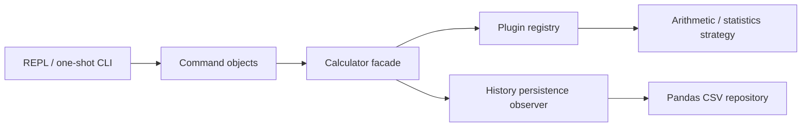

# Architecture and educational walkthrough

## The patterns, with purpose

**Command:** Parsing creates calculation, history, help, and exit command objects.
Each exposes `execute(context)`. Parsing syntax does not perform calculations or
write files. Commands make actions independently testable; they do not imply undo.

**Strategy:** Every operation implements the same plugin contract. The registry
selects a strategy by name. Addition and standard deviation use different
algorithms behind one interface. A plugin is the distribution and discovery
mechanism around a strategy, not another mathematical abstraction.

**Facade:** `Calculator.calculate(name, *args, **kwargs)` coordinates strategy
execution, validation, record creation, and history updates. Consumers need not
know how pandas or entry points work. `history`, `delete`, and `clear` complete
the application API.

**Observer:** A history subject notifies its configured persistence observer
before publishing a changed snapshot. If persistence fails, the mutation fails.
This is deliberately a synchronous, required observer: background best-effort
notifications would not meet the promise that reported success is saved.
Arbitrary transactional side effects across multiple observers are not supported.

**Repository:** `HistoryRepository` defines load/save. Pandas implements the
storage adapter. A different repository can replace it without changing arithmetic.

## SOLID in this project

| Principle | Concrete application |
| --- | --- |
| Single responsibility | Parser handles syntax, plugins handle math, repository handles CSV |
| Open/closed | Register a plugin instead of adding branches to the calculator |
| Liskov substitution | Plugins accept the shared calling contract and return finite numeric results |
| Interface segregation | Operation and repository protocols expose only their necessary methods |
| Dependency inversion | Facade receives a registry and history subject, not global pandas calls |

## Walk through `stddev 2 4 6 ddof=1`

1. Parser produces a calculation command with `(2.0, 4.0, 6.0)` and `{'ddof': 1.0}`.
2. Command invokes the facade; registry finds `stddev`.
3. Strategy validates n > ddof and delegates to Python's stable statistics routines.
4. Facade validates the result, makes an immutable record, and proposes a snapshot.
5. Persistence observer saves that snapshot through the injected repository.
6. History publishes its new state and the formatter displays `2`.

`*args` collects a variable number of positional values; `**kwargs` collects named
options. They provide flexibility while each plugin still enforces a strict contract.
An unknown option is an error, not silently ignored.

## Why this much structure?

A four-function calculator could be shorter. The boundaries here earn their place
through plugin extension, fault isolation, storage replacement, and testing. Avoid
adding factories, buses, or services until a concrete requirement needs them.

## References

- [Python packaging entry points](https://packaging.python.org/en/latest/specifications/entry-points/)
- [pandas CSV output](https://pandas.pydata.org/docs/reference/api/pandas.DataFrame.to_csv.html)
- [pandas CSV input](https://pandas.pydata.org/docs/reference/api/pandas.read_csv.html)
